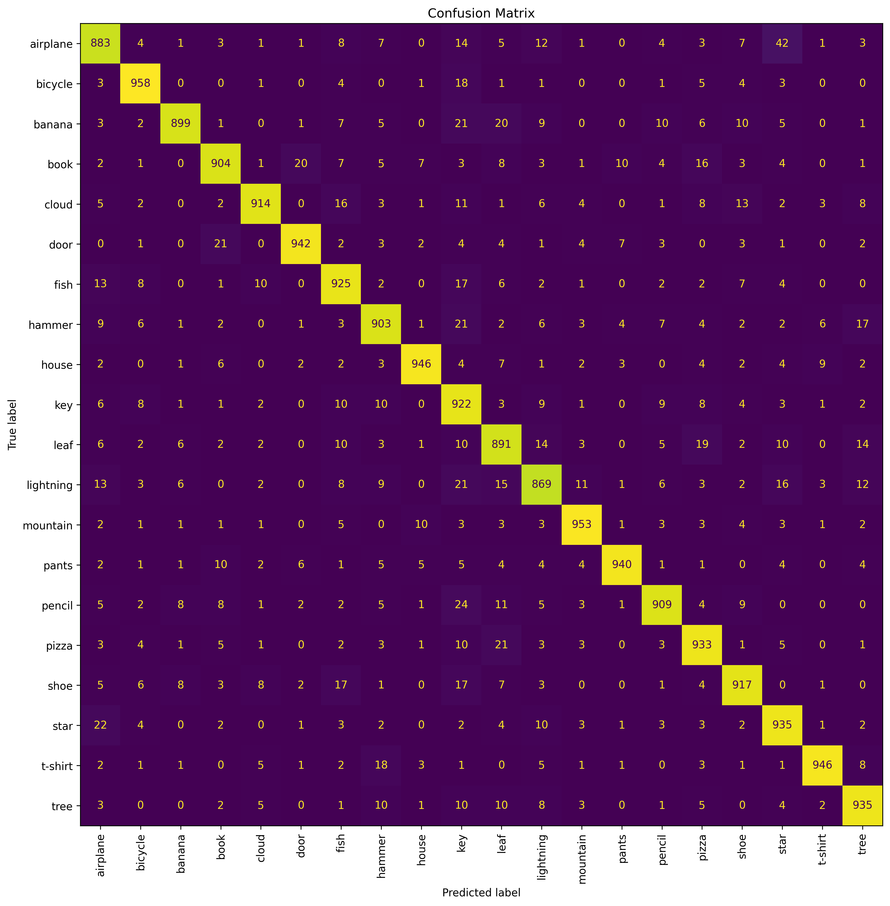
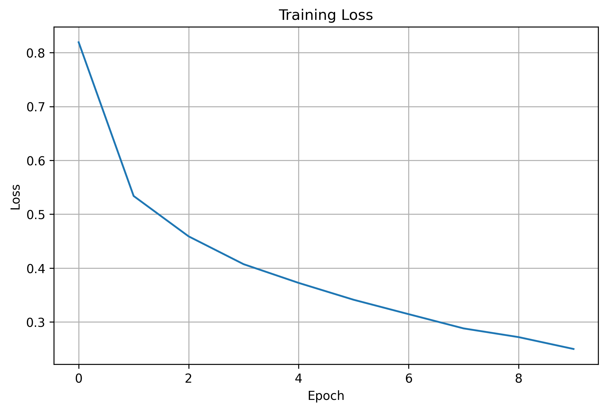
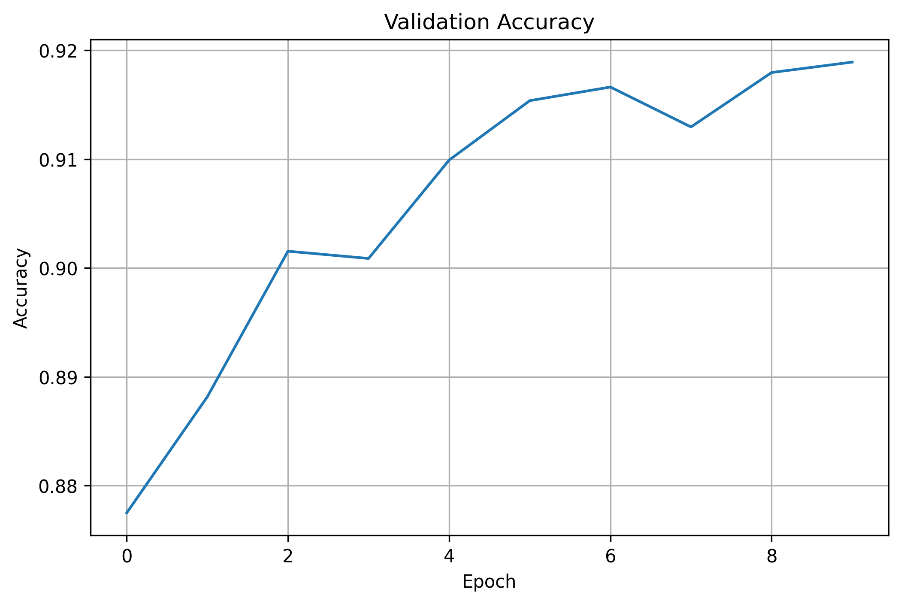

# QuickDraw Sketch Classification

A Convolutional Neural Network (CNN) built with PyTorch for recognizing hand-drawn sketches from the Google QuickDraw dataset.

## Introduction

This project implements a sketch classification system using a Convolutional Neural Network (CNN). The model is trained to recognize hand-drawn objects and can also be tested through a real-time drawing application built with OpenCV.

---
## Demo

### Video Demonstration


[https://github.com/user-attachments/assets/drawing_demo.mp4](https://github.com/user-attachments/assets/16fcab1e-9b06-4951-a9ac-d5dd7a04ab9f)

This video demonstrates the interactive drawing application, where users draw sketches directly on the canvas using a mouse. After each completed drawing, the CNN model processes the sketch and displays the predicted object category along with its confidence score below the canvas in real time.

---

## Dataset

The model is trained on a subset of the Google QuickDraw dataset, which contains millions of sketches collected from users worldwide. Each drawing is represented as a 28×28 grayscale image and stored in NumPy `.npy` format.
https://console.cloud.google.com/storage/browser/quickdraw_dataset/sketchrnn. For this project, only 20 files corresponding to 20 selected categories were used.

---

## Classes
The CNN model in this project is trained to classify sketches into the following 20 selected categories:

| ID | Class      |
| -- | ---------- |
| 1  | airplane   |
| 2  | bicycle    |
| 3  | banana     |
| 4  | book       |
| 5  | cloud      |
| 6  | door       |
| 7  | fish       |
| 8  | hammer     |
| 9  | house      |
| 10 | key        |
| 11 | leaf       |
| 12 | lightning  |
| 13 | mountain   |
| 14 | pants      |
| 15 | pencil     |
| 16 | pizza      |
| 17 | shoe       |
| 18 | star       |
| 19 | t-shirt    |
| 20 | tree       |


---

## Installation

```bash
git clone https://github.com/huudu05/QuickDraw-Sketch-Classifier.git

cd QuickDraw-Sketch-Classifier

pip install -r requirements.txt
```

---

## Training

Train the model using:

```bash
python train.py
```

The training pipeline automatically splits the dataset into training, validation, and testing sets, saves the best model checkpoint, and generates evaluation visualizations.

---

## Prediction

Run inference on a custom image using the trained model:

```bash
python predict.py
```

The script loads the trained model and outputs the predicted class along with its confidence score.

---

## Drawing Application

Launch the interactive drawing application:

```bash
python painting_app.py
```

Draw an object using the mouse and the model will predict the corresponding class after each completed stroke.

---

## Evaluation Metrics

The model is evaluated using the following metrics:

* Accuracy
* Precision
* Recall
* F1 Score
* Confusion Matrix

These metrics provide an overview of both overall performance and class-level classification quality.

---

## Results

### Confusion Matrix



### Loss Curve



### Accuracy Curve



---
## Requirements
* PyTorch
* TorchVision
* NumPy
* OpenCV
* Scikit-Learn
* Matplotlib
* TensorBoard
---
## Author

**Huu Du Nguyen**

